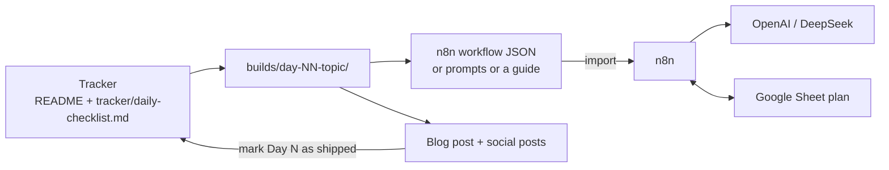
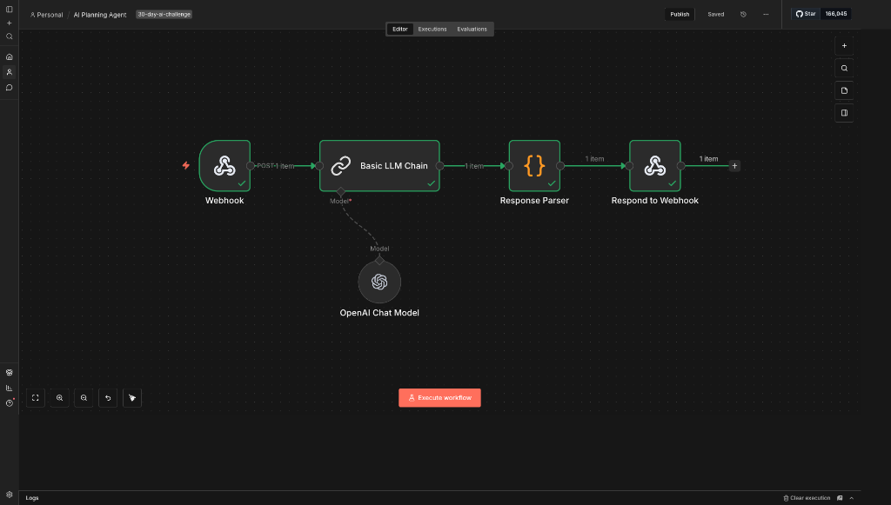

# 30-Day AI Ship Challenge

Build in public for 30 days to turn ideas into systems and systems into shipped work.

**Status:** Days 1–14 shipped between 2026-01-01 and 2026-01-17. Days 15–30 are planned topics and have not shipped.

## What this is and why

This challenge was about building the habit of shipping real work in public, every day.

The goal was not perfection or viral content. It was to create systems that remove decision fatigue, enforce
accountability, and turn ideas into tangible outputs: code, automations, content and learnings.

Each day has a topic and a pillar (Build, Automate, Mindset, Career, Proof). Each shipped day has a folder in
`builds/`, a published post, and a tick in the tracker below.

## What's inside

- **3 importable n8n workflows** (Days 2–4): an AI planning agent, a prompt evaluator and a content generator.
- **A prompt library** of 9 Markdown prompts (Day 3), each with Role, Context, Task, Format, Examples and Constraints.
- **10 written guides** (Days 5–14) on designing n8n and AI workflows: logic before AI, AI as a decision engine,
  prompts as contracts, output constraints, flow thinking, learning automation, structured agents, guardrails and
  memory. They include Code-node snippets you can paste into n8n.
- **Templates**: an agent spec template, an empty n8n workflow, and a copy of the planning agent.
- **The tracker**: the 30-day plan with links to every published post.

## Workflows

| Day | Workflow | File | What it does | Needs |
|:---:|---|---|---|---|
| 2 | AI Planning Agent | [`builds/day-02-ai-planning-agent/workflow.json`](builds/day-02-ai-planning-agent/workflow.json) | Takes a task over a webhook and returns a JSON plan: analysis, 3–7 steps with time estimates and dependencies, and 2–3 next actions. | OpenAI credential (model `gpt-4.1-mini`) |
| 3 | Prompt Eval + Rewrite | [`builds/day-03-prompt-system/workflow.json`](builds/day-03-prompt-system/workflow.json) | An n8n form: paste a prompt (plus optional test input, audience, tone); DeepSeek rewrites it and scores it out of 10 (clarity, completeness, tone, format). | `DEEPSEEK_API_KEY`; see Known issues |
| 4 | Content Generator | [`builds/day-04-automation-mindset/content-generator-workflow.json`](builds/day-04-automation-mindset/content-generator-workflow.json) | Reads a day from a Google Sheet plan, has DeepSeek draft an Instagram script (Hinglish), a blog post and a LinkedIn post as one JSON object, validates it, and writes it back to the sheet. | Google Sheets and DeepSeek credentials, your sheet ID |

`templates/ai-planning-agent-workflow.json` is the same workflow as Day 2, and `resources/Content Generator.json` is the
same as Day 4.

## Architecture



- Day 2: Webhook (`POST task-planner`) → Basic LLM Chain with the OpenAI Chat Model → Response Parser (Code) → Respond
  to Webhook.
- Day 3: Form Trigger → HTTP Request to the DeepSeek chat completions API → Clean & Parse JSON (Code) → Form result page.
- Day 4: Manual Trigger → Read Plan Rows (Google Sheets) → Agent with the DeepSeek Chat Model → Parse + Validate JSON
  (Code) → IF Valid Output → Update Row in Sheet (Google Sheets).

## Quick start

There is nothing to install or build. You need an n8n instance (self-hosted or n8n Cloud).

1. Clone the repo:

   ```bash
   git clone https://github.com/avnishyadav25/30-day-ai-ship-challenge.git
   ```

2. In n8n, create a new workflow, open the menu and choose **Import from File**. Pick one of the workflow files above.
3. Add the credentials the workflow needs (see below) and attach them to the nodes that show a credential warning.
4. Run it with **Execute workflow** or the node's test button. All exports are saved inactive; activate a workflow
   only if you want its production URL.

### Credentials and environment variables (names only)

| Name | Type | Used by |
|---|---|---|
| `openAiApi` | n8n credential (OpenAI) | Day 2, OpenAI Chat Model node |
| `deepSeekApi` | n8n credential (DeepSeek) | Day 4, DeepSeek Chat Model node |
| `googleSheetsOAuth2Api` | n8n credential (Google Sheets OAuth2) | Day 4, both Google Sheets nodes |
| `DEEPSEEK_API_KEY` | environment variable of the n8n instance | Day 3, read with `$env` in the HTTP Request header; the instance must allow env access in nodes (n8n setting `N8N_BLOCK_ENV_ACCESS_IN_NODE`) |

Never commit keys. The exports in this repo contain no API keys.

## Usage

### Day 2: AI Planning Agent

Call the webhook with a JSON body that has a `task` field:

```bash
curl -X POST <YOUR_N8N_WEBHOOK_URL>/task-planner \
  -H 'Content-Type: application/json' \
  -d '{"task": "Build a landing page"}'
```

The response follows the schema in [`planning_prompt.md`](builds/day-02-ai-planning-agent/planning_prompt.md):
`analysis` (complexity, domain, key_challenges), `plan` (total_steps, estimated_total_time, steps) and `next_actions`.
If the model returns invalid JSON, the parser returns `{ "error": "JSON Parsing failed", "raw": "…" }` instead of
failing. After import, check that the Webhook node responds using the "Respond to Webhook" node.

### Day 3: Prompt Eval + Rewrite

Fix the URL first (see Known issues), set `DEEPSEEK_API_KEY`, then open the form URL from the Form Trigger node. The
prompts it was built for are in [`builds/day-03-prompt-system/prompts/`](builds/day-03-prompt-system/prompts/).

### Day 4: Content Generator

Make a Google Sheet with the columns `Day`, `Core Topic`, `Pillar`, `What I Learn (Core Lesson)`,
`Description (200–300 words)`, `CTA`, `Picked`, `Status`, `Result`, and put its ID in place of `YOUR_GOOGLE_SHEET_ID`
in both Google Sheets nodes. The read node filters on the `Picked` column; adjust that filter to choose which rows run.
Valid output is written to the `Result` column of the row with the same `Day`. The export includes pinned sample data
(the Day 1 row and a Day 1 draft), so you can test the parsing and validation steps before connecting any account.
The agent prompt is in [`content-generator-prompt.md`](builds/day-04-automation-mindset/content-generator-prompt.md).

## Known issues

- **Day 3:** the HTTP Request node's URL field contains Markdown link text
  (`[https://api.deepseek.com/chat/completions](…)`). Replace it with `https://api.deepseek.com/chat/completions`
  before running.
- **Day 2:** the Day 2 README describes `gpt-3.5-turbo`, temperature 0.3 and 1500 max tokens; the exported workflow
  uses `gpt-4.1-mini` with a 60-second timeout. The workflow file is the source of truth.
- Days 5–14 are written guides; their snippets are not exported as workflows or tested in this repo.

## Demo

<!-- demo video: TBD -->

Day 2, AI Planning Agent:



Day 4, Content Generator:


## Repository layout

```text
builds/      one folder per shipped day: day-01-system-setup … day-14-memory-management
templates/   agent-spec-template.md, n8n-workflow-template.json, ai-planning-agent-workflow.json
tracker/     daily-checklist.md (same table as below)
resources/   Content Generator.json (copy of the Day 4 workflow)
```

Day folders are named `day-NN-short-topic`. The [Live Tracker (Google Sheet)](https://docs.google.com/spreadsheets/d/15Ke4jvX-xAfAcp3QwvxNKi6e1kJIQlfceT_ITaokwo0/edit?usp=sharing)
mirrors the plan.

## Daily checklist

Days 1–14 shipped. Days 15–30 are planned and not shipped.

| Day | Core Topic | Pillar | Shipped? | Platform Post | Description |
| :---: | :--- | :--- | :---: | :--- | :--- |
| 1 | Kickoff: 30-Day AI shipping challenge | Career/Brand | [x] | [Blog Post](https://blog.avnishyadav.com/2026/01/30-day-ship-system-accountability-engine.html) <br> [LinkedIn](https://www.linkedin.com/posts/avnishyadav25_the-30-day-ship-system-how-i-built-my-accountability-activity-7412521632751316992-TDZs) <br> [X Post](https://x.com/avnish_yadav25/status/2006757186358350246) / [Thread](https://x.com/avnish_yadav25/status/2006758389708439572) <br> [Threads Post](https://www.threads.com/@avnish.codes/post/DS-Whm4Eiw0) / [Thread](https://www.threads.com/@avnish.codes/post/DS-W9exEiFS) <br> [IG Carousel](https://www.instagram.com/avnish.codes/p/DS-g-b2k1pa/) / [Reel](https://www.instagram.com/p/DTAg3Pnk6pe/) / [Post](https://www.instagram.com/p/DTAh2hiEzYj/) <br> [YT Short](https://youtube.com/shorts/tyMmfqkYYG8?feature=share) <br> [Reddit](https://www.reddit.com/r/SideProject/comments/1q1xk1x/starting_a_30day_ai_public_shipping_challenge/) <br> [Facebook](https://www.facebook.com/avnishyadav25/posts/pfbid02UP4WLNWmFoxX9YdmhViZwauuqXfzHmHJsnmWcWXg3yzDL6ciuFhVbeHMAnb5SRNUl) | ICP + content principles + "what I won't post" rules + cadence math |
| 2 | Build an AI Agent in 10 minutes | Build | [x] | [Blog Post](https://blog.avnishyadav.com/2026/01/first-ai-planning-agent-10-minutes-n8n-tutorial.html) <br> [LinkedIn](https://www.linkedin.com/feed/update/urn:li:activity:7413162844856418305/) <br> [X Post](https://x.com/avnish_yadav25/status/2007398320713691152) / [Thread](https://x.com/avnish_yadav25/status/2007397864096620549) <br> [Threads Post](https://www.threads.com/@avnish.codes/post/DTC5SHRkrH6) / [Thread](https://www.threads.com/@avnish.codes/post/DTC5Yw5kqOZ?xmt=AQF0BYzk9N4qVfQnqDIqtVw0tR_-SYyv-LPTQce5zSBUETI) | Agents 101: roles/tools/memory + failure modes |
| 3 | Prompt upgrades that 2× output quality | Automate | [x] | [Blog Post](https://blog.avnishyadav.com/2026/01/personal-prompt-system-double-ai-output-quality.html) | Prompt frameworks: role/context/constraints + eval basics |
| 4 | Why Early Devs Lose to Automation | Mindset | [x] | [Blog Post](https://blog.avnishyadav.com/2026/01/why-early-developers-lose-to-automation.html) <br> [LinkedIn](https://www.linkedin.com/posts/avnishyadav25_developers-automation-n8n-activity-7414157712055365632-UyHD) <br> [X Post](https://x.com/avnish_yadav25/status/2008392833741578500) <br> [Threads Post](https://www.threads.com/@avnish.codes/post/DTJ9Qiwkoa4) | Automation is leverage, not shortcuts. Early devs believe automation is "advanced" or "later-stage." That belief is wrong. |
| 5 | What n8n Really Is (Not Just a Tool) | Build | [x] | [Blog Post](https://blog.avnishyadav.com/2026/01/n8n-thinking-framework-for-developers.html) | n8n is a thinking framework. Most tutorials explain n8n as "Zapier alternative." That's misleading. |
| 6 | Your First Real Automation (No AI) | Build | [x] | [Blog Post](https://blog.avnishyadav.com/2026/01/stop-adding-ai-before-you-have-logic-build-reliable-n8n-workflows-first.html) <br> [LinkedIn](https://www.linkedin.com/posts/avnishyadav25_n8n-automation-aiworkflows-activity-7415001831686369280-Qch8) | Logic before intelligence. AI is useless without logic. |
| 7 | When AI Actually Adds Value | Build | [x] | [Blog Post](https://blog.avnishyadav.com/2026/01/ai-decision-engine-not-replacement.html) | AI = decision engine, not replacement. Classification, summarization, scoring, rewriting. |
| 8 | Prompting Is Not Chatting | Automate | [x] | [Blog Post](https://blog.avnishyadav.com/2026/01/stop-writing-prompts-that-fail-contract-based-approach.html) | Prompts are contracts. Prompts as specifications with inputs, constraints, and outputs. |
| 9 | Why Your AI Output Is Generic | Automate | [x] | [Blog Post](https://blog.avnishyadav.com/2026/01/ai-output-average-missing-constraints.html) | Missing constraints cause bad output. AI produces average output because developers give average instructions. |
| 10 | The Automation Mental Model | Mindset | [x] | [Blog Post](https://blog.avnishyadav.com/2026/01/automation-breaking-think-features-not-flows.html) | Think in flows, not features. Input → transform → decide → output. |
| 11 | Automating Learning Itself | Automate | [x] | [Blog Post](https://blog.avnishyadav.com/2026/01/stop-studying-manually-automate-learning-n8n-ai.html) | Learn faster with systems. Automate notes, summaries, and revision using n8n + AI. |
| 12 | Building Your First AI Agent (Properly) | Build | [x] | [Blog Post](https://blog.avnishyadav.com/2026/01/ai-agents-structured-workflows-not-magic.html) | Agents need structure. Agents as workflows with memory and rules — not magic bots. |
| 13 | Why Most AI Agents Fail | Build | [x] | [Blog Post](https://blog.avnishyadav.com/2026/01/ai-agent-guardrails-hallucinations-memory-validation.html) | Missing guardrails. Hallucinations, memory drift, and lack of validation. |
| 14 | Memory in Automation Systems | Build | [x] | [Blog Post](https://blog.avnishyadav.com/2026/01/short-term-vs-long-term-memory-ai-systems.html) | Memory must be controlled. Short-term vs long-term memory and when to use each. |
| 15 | Scoring AI Output | Automate | [ ] | | AI must be judged. Scoring outputs (clarity, usefulness, accuracy) and rejecting bad responses. |
| 16 | Multi-Step AI Pipelines | Build | [ ] | | One call is not enough. Chaining AI steps (generate → score → rewrite) produces professional output. |
| 17 | Parallel vs Sequential Automation | Build | [ ] | | Speed vs accuracy tradeoff. When to fan out calls and when to gate them. |
| 18 | Debugging Automations | Career | [ ] | | Systems fail quietly. Logging, checkpoints, and failure visibility in n8n. |
| 19 | Automation as Portfolio | Career | [ ] | | Proof beats certificates. Automation demos outperform resumes. |
| 20 | Thinking Like a Systems Engineer | Career | [ ] | | Systems > scripts. Logic, AI, memory, scoring, flows — the mindset shift. |
| 21 | Why Consistency Beats Talent | Mindset | [ ] | | Systems remove motivation. Automation removes reliance on discipline and motivation. |
| 22 | Turning Automations into Products | Career | [ ] | | Internal tools → assets. Personal automations become products or templates. |
| 23 | Content Automation for Devs | Automate | [ ] | | Teaching scales trust. Dev content can be automated without losing quality. |
| 24 | Avoiding Automation Overengineering | Build | [ ] | | Simple > complex. Restraint and minimalism in system design. |
| 25 | When NOT to Automate | Mindset | [ ] | | Judgment matters. Opportunity cost and maintenance burden. |
| 26 | How Seniors Actually Work | Career | [ ] | | Seniors think in leverage. Junior vs senior workflows using automation examples. |
| 27 | Building in Public (Correctly) | Career | [ ] | | Teach systems, not progress. Why posting "learning" fails and teaching systems works. |
| 28 | Your Automation Stack Blueprint | Build | [ ] | | A reusable architecture. Full stack as a reference model. |
| 29 | 30 Days of Systems: Lessons | Proof | [ ] | | What actually worked. Real learnings, not vanity metrics. |
| 30 | Your Next 90-Day Path | Career | [ ] | | Direction beats speed. Clear next roadmap using automation. |

## Guardrail rules

What I won't post:

- No vague motivational content without concrete steps
- No promises of "overnight results" or "secret hacks"
- No content about tools I haven't personally used in the challenge
- No engagement bait that doesn't deliver real value

## License

No license file yet, so default copyright applies.

## Author

Avnish Yadav, AI automation engineer. Website: https://avnishyadav.com
