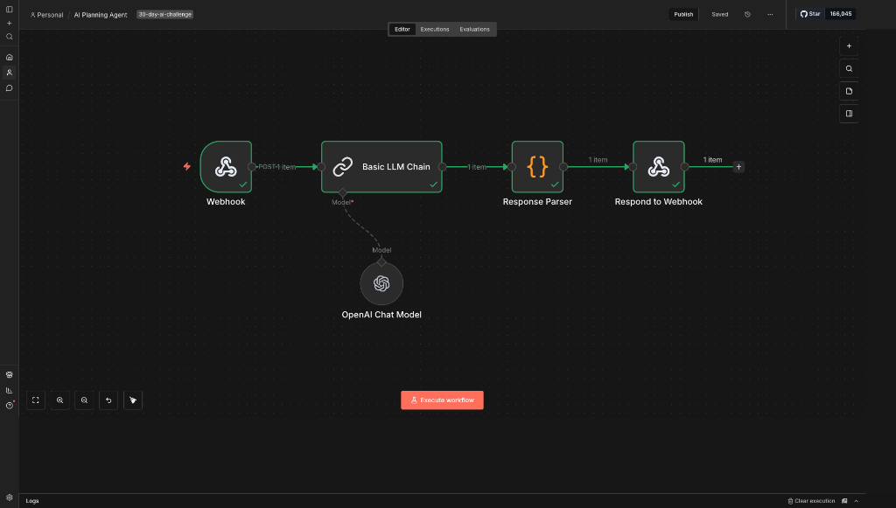

# Day 02: Build an AI Agent in 10 minutes

## Output
- **Blog Post**: [Create Your First AI Planning Agent in 10 Minutes (n8n Tutorial)](https://blog.avnishyadav.com/2026/01/first-ai-planning-agent-10-minutes-n8n-tutorial.html)
- **LinkedIn Post**: [Post](https://www.linkedin.com/feed/update/urn:li:activity:7413162844856418305/)
- **X (Twitter)**: [Post](https://x.com/avnish_yadav25/status/2007398320713691152) | [Thread](https://x.com/avnish_yadav25/status/2007397864096620549)
- **Threads**: [Post](https://www.threads.com/@avnish.codes/post/DTC5SHRkrH6) | [Thread](https://www.threads.com/@avnish.codes/post/DTC5Yw5kqOZ?xmt=AQF0BYzk9N4qVfQnqDIqtVw0tR_-SYyv-LPTQce5zSBUETI)
## TL;DR
I'll show you how to build a working AI planning agent using n8n that takes any task and returns structured plans with clear next actions. You'll get the complete workflow, tested prompts, and a ready-to-use template. This isn't theory—it's the exact system I use daily to manage projects and content creation.

> **"Build a landing page"** → **"1. Wireframe 2. Copy 3. Deploy"**

**Live Webhook URL**: `https://n8n.avnishcodes.cloud/webhook/task-planner`

## The Workflow

The agent has three core functions:
1.  **Accepts any task description** (via webhook or manual input)
2.  **Analyzes and structures the task** into logical steps
3.  **Outputs prioritized next actions** with time estimates

### Components
1.  **Webhook Node (Trigger)**: Receives task input.
2.  **OpenAI Node (Planning Engine)**: Uses GPT-3.5-turbo with a structured prompt.
3.  **Function Node (Response Parser)**: Validates JSON and handles errors.
4.  **Output Node (Results)**: Displays the plan.

## The Planning Prompt
See [planning_prompt.md](./planning_prompt.md) for the exact prompt used.

## Configuration
-   **Model**: gpt-3.5-turbo
-   **Temperature**: 0.3
-   **Max Tokens**: 1500

## Parsing Logic
The function node extracts JSON from the AI response and validates the structure:
-   `analysis`: complexity, domain, challenges.
-   `plan`: steps, time estimates, dependencies.
-   `next_actions`: immediate next steps.

## Deliverables
-   [x] n8n Workflow JSON ([workflow.json](./workflow.json))
-   [x] Planning System Prompt ([planning_prompt.md](./planning_prompt.md))
-   [x] Blog Post Published
